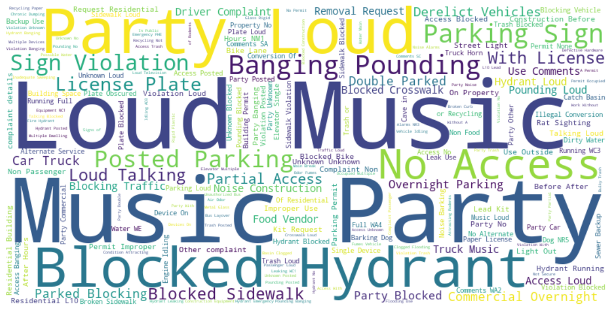
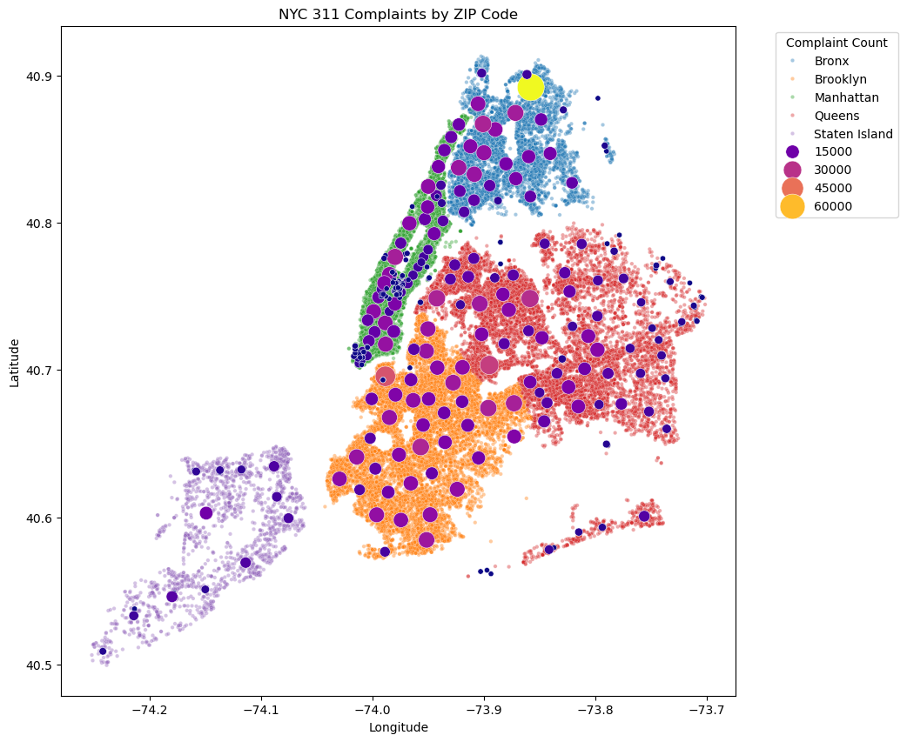

# nyc-311-complaint-analysis
## The City That Never Sleeps...But Complains a Lot!

**Author: MD A Rahman Ruhel**     
**Project Type: Exploratory Data Analysis & Storytelling**  
Date: Nov-2025  

**Overview**  
This project explores NYC 311 service request data of year 2024 to uncover patterns in complaints across the city. The analysis focuses on what New Yorkers complain about, when, and where, highlighting trends by borough, ZIP code, location type, and time of day/week.  
The project combines data visualization, keyword analysis, and storytelling to reveal the city’s complaint hotspots and trends in a fun and insightful way.  

**Key Questions**  
What are the top complaint types in NYC?  
Which boroughs and ZIP codes report the most complaints?   
How do complaints vary by time of day, day of week, and weekend vs weekday?   
What are the most common locations for complaints?  
What keywords appear most frequently in complaint descriptions?  

**Data**    
*Source: NYC Open Data (311 Service Requests)*  
**Key Columns**: *Complaint Type, Borough, Incident Zip, Created Date, Closed Date, Descriptor, Location Type, Latitude, Longitude*  
**Dataset Size**: ~2.5 million rows (sampled for visualization)

**Analysis & Visualizations**  

- Top Complaints: Barplots and treemaps for overall and borough-wise trends  
- Geographical Spread:  
  - ZIP code bubble map (size shows volume of complaints)  
  - Treemap of top 20 complaining ZIPs  
  - Temporal Patterns: Hourly trends, weekday vs weekend, day vs night comparisons  
  - Complaint Locations: Top location types (streets, residential buildings, etc.)  
- Keyword Extraction: Word clouds of most frequent phrases  

**Key Insights**
- Noise complaints dominate; residential and street/sidewalk noise top the charts  
- Brooklyn and Queens dominate most complaint types; Bronx leads in residential noise  
- Hotspot ZIP codes include Bronx 10466 and several Brooklyn/Queens ZIPs  
- Complaints spike at midnight, 9 AM, and late evening; weekends show more residential noise  
- Streets and sidewalks see the highest complaint volume
- 
**Common keywords**: “loud music,” “party,” “blocked hydrant,” “parking violation”  

## 📂 Repository Structure

├── README.md  
├── The City That Never Sleeps but Complains A Lot.ipynb  
└── charts/  
    ├── top_zip_bubble.png  
    ├── borough_top_complaints.png  
    ├── weekday_patterns.png  
    ├── location_type_bar.png  
    └── wordcloud.png
